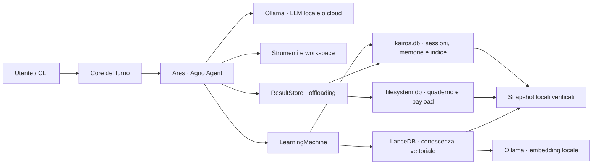

# Ares


[](https://www.python.org/)
[](https://ollama.com/)
[](https://www.agno.com/)
[](#requisiti)
[](LICENSE)
[](https://github.com/KairosIta/Ares/actions/workflows/ci.yml)

Assistente AI personale local-first costruito con Python, Ollama e Agno.
Ares conversa, usa strumenti, mantiene memoria fra sessioni e lavora in uno
spazio controllato sul disco senza richiedere API cloud.

> **English summary:** Ares is a local-first personal AI agent built with
> Ollama and Agno. It combines persistent memory, tool use, a private
> workspace, verified local backups and explicit maintenance workflows in a
> reproducible Python project.

## Perché Ares

- **Inferenza locale, cloud su scelta esplicita:** di serie niente lascia
  la macchina — conversazione, estrazione delle memorie ed embedding girano
  tutti su Ollama in `localhost`. Due righe nel `.env` (`ARES_MAIN_MODEL`,
  `ARES_LEARNING_MODEL`) spostano conversazione ed estrazione, insieme o
  separatamente, su un modello cloud di Ollama, inoltrato dallo stesso
  daemon senza chiavi API nell'ambiente. Solo l'embedding resta locale
  sempre.
- **Memoria persistente:** profilo, memorie, contesto di sessione, entità e
  conoscenza riutilizzabile attraverso SQLite e LanceDB.
- **Apprendimento affidabile:** l’estrazione avviene sul run completo, anche
  dopo una conferma e `continue_run`, con retry mirato sul contesto.
- **Strumenti controllati:** cronologia, ricerca, quaderno privato e la
  cartella da cui lanci `ares` come spazio di lavoro. Leggere, elencare e
  cercare non chiedono niente; scrivere, modificare, spostare, cancellare ed
  eseguire comandi chiedono conferma uno per uno, con il contenuto per
  intero, e c'è un avviso prima di aprire una cartella rischiosa.
- **Memoria visibile e revocabile:** sotto ogni risposta compare cosa è
  entrato in profilo e memorie, sia dagli strumenti del modello sia
  dall'estrazione automatica, con il testo intero, e la CLI chiede se
  tenerlo: un `n` riporta i due store a prima del turno. Tace quando non è
  cambiato niente.
- **Contesto protetto:** entro la quota Agno i risultati molto grandi restano
  lossless negli archivi locali e vengono riletti a pagine, mentre le tool
  call storiche nel prompt hanno un limite esplicito.
- **Manutenzione esplicita:** audit e fusione delle entità duplicate e
  retention delle sessioni, con anteprima, lock, backup e rollback.
- **Backup locale verificato:** snapshot atomici dello stato persistente,
  restore protetto e retention configurabile.
- **Evidenza riproducibile:** prove isolate su archivi temporanei e test E2E
  reali contro Ollama.

## Architettura



Il modello principale risponde e usa gli strumenti. I risultati grandi
vengono indicizzati nel database principale e conservati in
`filesystem.db`, entrambi inclusi negli snapshot. Dopo il turno, la macchina
di apprendimento aggiorna gli store configurati; entità e intuizioni restano
invece agentiche e vengono consultate o modificate solo quando Ares decide di
chiamarne gli strumenti.

## Requisiti

- Linux o Windows; la CI verifica Ubuntu 24.04 e `windows-latest`;
- Python 3.12, installabile automaticamente da `uv`;
- [`uv`](https://docs.astral.sh/uv/);
- [Ollama](https://ollama.com/) in ascolto su `localhost:11434`;
- spazio sufficiente per i modelli configurati.

Su Windows, [Ollama richiede Windows 10 22H2 o
successivo](https://docs.ollama.com/windows). Il percorso verificato dal
progetto è Windows x86_64 con PowerShell; macOS e altre distribuzioni Linux
possono funzionare, ma non sono ancora nella matrice CI.

La configurazione di riferimento è pensata per circa 16 GiB di VRAM. Il
modello locale Qwen3.8-9B Q8_0 richiede circa 14 GB con 262k token di
contesto quando è lui a conversare, e circa 9 GB quando fa solo l'estrazione
delle memorie accanto a un modello cloud: in quel caso `LEARNING_NUM_CTX`
riduce la sua finestra a 32k, perché un'estrazione riceve solo il testo del
turno. Su hardware diverso è possibile scegliere un modello più piccolo e
ridurre `NUM_CTX` in [`ares/config.py`](ares/config.py).

I modelli sono artefatti esterni, non inclusi nel repository: consulta la
[model card di Qwen3.8-9B-Distill](https://huggingface.co/empero-ai/Qwen3.8-9B-Distill-GGUF)
e la [scheda di glm-5.3-flash](https://ollama.com/library/glm-5.3-flash) per
licenza, provenienza e limiti. Le risposte tecniche o sensibili richiedono
verifica umana.

### Modello conversazionale locale o cloud

**Il valore distribuito è locale:** appena clonato, Ares risponde con
`MODELLO_LOCALE`, che gira in scheda, e nessuna conversazione esce dalla
macchina. Per usare un [modello cloud di Ollama](https://ollama.com/search?c=cloud)
— riconoscibile dal tag `:cloud` — basta una riga nel `.env`, senza toccare
`config.py`, che tornerebbe a divergere a ogni `git pull`:

```bash
ARES_MAIN_MODEL=glm-5.3-flash:cloud
```

Il daemon locale lo inoltra a `ollama.com` dopo un `ollama signin` una
tantum: Ares continua a parlare con `localhost`, e nessuna chiave API entra
nell'ambiente o in `.env`. Con un modello cloud i prompt e le risposte della
conversazione escono dalla macchina; l'estrazione delle memorie resta locale
finché non lo decidi tu, con una seconda riga:

```bash
ARES_LEARNING_MODEL=glm-5.3-flash:cloud
```

È una scelta separata perché risponde a un'altra domanda — a chi affidi ciò
che Ares ricorda di te — e pesa di più: ogni estrazione manda al modello il
testo del turno e le memorie già salvate. Con entrambe le righe nessun peso
gira in scheda, salvo l'embedder: quello resta locale per costruzione, non
per configurazione — `assistant_runtime` si rifiuta di costruirlo su un
nome cloud — perché cambiarlo invaliderebbe l'indice già scritto. Il
preflight e il banner della chat dicono a ogni avvio quali ruoli escono
dalla macchina. Con la sola conversazione in cloud il modello locale serve
solo l'estrazione e gira con un contesto ridotto, liberando VRAM; con lo
stesso modello locale in entrambi i ruoli, cioè con il default, i due
contesti restano uguali, così Ollama non riavvia il runner fra risposta ed
estrazione.

Ollama dichiara di elaborare quei contenuti in modo transitorio, di non
conservarli oltre la richiesta e di non usarli per addestrare
([privacy policy](https://ollama.com/privacy), marzo 2026). È un impegno
contrattuale, non una garanzia tecnica: per un uso interamente locale basta
non impostare né `ARES_MAIN_MODEL` né `ARES_LEARNING_MODEL`.

## Avvio rapido

Installa [uv](https://docs.astral.sh/uv/getting-started/installation/) e
[Ollama](https://ollama.com/download), quindi scarica i due modelli della
configurazione predefinita:

```bash
ollama pull hf.co/empero-ai/Qwen3.8-9B-Distill-GGUF:Q8_0
ollama pull nomic-embed-text-v2-moe
```

Solo se scegli la conversazione in cloud servono anche l'accesso e il
manifesto del modello remoto — il pull scarica il solo manifesto, l'accesso
serve alla prima richiesta:

```bash
ollama signin
ollama pull glm-5.3-flash:cloud
```

Clona il progetto:

```bash
git clone https://github.com/KairosIta/Ares.git
cd Ares
```

Su Linux:

```bash
./setup.sh
ares
```

Su Windows, da PowerShell:

```powershell
.\setup.ps1
ares
```

Se la policy di PowerShell impedisce l’avvio dello script locale, usa una
sola volta `powershell -ExecutionPolicy Bypass -File .\setup.ps1`.

Se Ollama non è già attivo, avvialo prima con `ollama serve`. Entrambi gli
script di setup creano il virtualenv, installano esattamente le versioni di
[`uv.lock`](uv.lock) e Ares stesso, mettono `ares` sul PATH ed eseguono il
preflight. Da quel momento `ares` si scrive da qualunque cartella: su Linux è
un link in `~/.local/bin` al comando del venv, su Windows uno shim `ares.cmd`
in `%USERPROFILE%\.local\bin`; se quella directory non è nel PATH il setup
dice la riga da aggiungere. Non è un `uv tool install`, che risolverebbe le
dipendenze da capo senza guardare il lock: il comando globale è esattamente
l'ambiente bloccato e segue il codice del clone a ogni pull.

`ares` da solo apre la chat, `ares --help` elenca i sottocomandi di
manutenzione (`ares backup`, `ares sessions`, `ares entities`, `ares
preflight`, `ares inspect`, `ares migrate`). Gli alias `ares-backup`,
`ares-sessions`... restano e fanno la stessa cosa; `python -m ares` continua a
funzionare dal clone. Su Windows `setup.ps1 -SkipPreflight` prepara soltanto
le dipendenze e viene usato dalla CI, dove Ollama non è disponibile.

Tutto ciò che Ares impara vive in `~/.ares`: lo stato in `stato/`, gli
snapshot in `backup/`, fuori dal clone, che si può spostare o rifare senza
perdere niente. `ARES_HOME` nel `.env` sposta tutto altrove. Chi aggiorna un
clone che teneva lo stato in `tmp/` non deve fare niente: il setup chiama
`ares migrate`, che sposta stato e snapshot in `~/.ares` una volta sola, e la
chat si rifiuta di partire finché lo stato è ancora nel posto di prima,
perché un archivio vuoto accanto a uno pieno li sdoppierebbe.

Ares lavora nella cartella da cui lo lanci, come Claude Code o Codex: entra
nel progetto e scrivi `ares`. Il banner mostra la cartella e, se è un
repository, il ramo. Gli strumenti sui file non escono da lì; leggere,
elencare e cercare non chiedono niente, tutto ciò che lascia una traccia sul
disco — scrivere, modificare, spostare, cancellare, eseguire un comando —
chiede conferma uno per uno, mostrando per intero cosa sta per succedere.
Se la cartella è rischiosa — la home intera,
la radice del disco, una directory di sistema, una che contiene lo stato o il
codice di Ares — te lo dice e chiede di riscrivere il percorso prima di
partire; da uno script senza terminale una cartella così si apre solo
nominandola con `--workspace`. Per lavorare su un'altra cartella senza
spostarti:

```bash
ares --workspace ~/progetti/demo
```

Se nella cartella c'è un `ARES.md`, Ares lo legge prima del primo turno: è
il posto per le convenzioni del progetto, cosa non toccare, come si lanciano
le prove. Lo riceve come regole del progetto, delimitate, non come ordini
tuoi: le applica finché non contraddicono ciò che gli chiedi, e nulla che
scriva o lanci comandi parte per conto del file. `ares init` ne scrive uno
scheletro nella cartella corrente e non tocca un file che esiste già.

Ogni `ares` apre una conversazione nuova, che nasce nella cartella e la
ricorda: profilo e memorie ci sono comunque, perché sono tuoi e non della
conversazione, mentre obiettivo, piano e avanzamento partono vuoti. Per
tornare dove eri:

```bash
ares resume            # l'ultima conversazione nata in questa cartella
ares resume --scegli   # la scegli da un elenco numerato
```

Le conversazioni di altre cartelle non c'entrano: `/sessioni` mostra quelle
di qui, `/sessioni tutte` le altre, e anche Ares riceve all'avvio le ultime di
questa cartella, con l'id, così "dove eravamo rimasti" funziona anche in una
conversazione nuova. Un nome fisso resta possibile con `--session`:

```bash
ares --session progetto-demo
```

Per una risposta sola, anche dentro una pipe, `-p`: stdin si aggiunge alla
domanda, le operazioni che chiederebbero conferma vengono rifiutate e niente
entra in memoria, perché non c'è nessuno a rispondere né a leggere cosa
sarebbe entrato. Ares lo sa dal prompt: ciò che già ricorda di te c'è, ciò
che impara in quel turno finisce con la risposta.

```bash
git diff | ares -p "scrivi il messaggio di commit"
```

Su Windows il comando equivalente è:

```powershell
ares --session progetto-demo
```

Durante la chat `/` apre il menu dei comandi e TAB completa la voce
selezionata. Invio spedisce il messaggio, `Alt+Invio` aggiunge una nuova riga,
le frecce percorrono la cronologia e i suggerimenti riprendono le domande
precedenti. Fra i comandi principali: `/profilo`, `/memorie`, `/contesto`,
`/sessioni`, `/entita`, `/file` e `/cartella`, che mostra percorso, ramo,
file modificati e se c'è un `ARES.md`. Tre cambiano la sessione in corso
senza riavviare: `/sessione <id>` passa a un'altra conversazione, `/metriche`
accende il costo di ogni turno, `/debug` le chiamate al modello.

## Verifica

La suite evita lo stato reale e costruisce archivi temporanei usa-e-getta.
I comandi seguenti mostrano il prefisso Linux; su Windows sostituisci
`.venv/bin/python` con `.\.venv\Scripts\python.exe`.

```bash
# Le prove offline: cablaggio, retention, backup/restore, entità e CLI
.venv/bin/python tests/run.py

# Anche quelle che accendono Ollama, incluso un turno completo
.venv/bin/python tests/run.py --tutte

# Offline, con la misura di copertura dei moduli
.venv/bin/python tests/run.py --copertura
```

Ogni prova resta anche uno script eseguibile da solo
(`.venv/bin/python tests/backup_test.py`); il runner le lancia una per
processo, perché ognuna prepara il proprio archivio temporaneo prima di
importare la configurazione.

La distinzione fra test offline ed E2E è descritta nella
[guida ai test](docs/testing.md).

## Operazioni

I comandi di manutenzione mostrano tabelle sul terminale e testo piatto in
una pipe; gli errori vanno su stderr. Prima di toccare lo stato chiedono di
riscrivere una frase esatta, con lo stesso editor della chat; `--yes` la
salta, e da uno script la frase si passa su stdin. Quelli che leggono soltanto accettano
`--json` per gli script: `ares backup list --json`, `ares backup verify
--json`, `ares sessions status --json`, `ares entities audit --json`,
`ares preflight --json`. Il codice di uscita non cambia.

### Backup

```bash
ares backup create
ares backup list
ares backup verify latest
ares backup restore <snapshot>
ares backup prune --keep 20
```

Gli snapshot vivono per default in `~/.ares/backup`, accanto allo stato e
fuori dal clone; `ARES_BACKUP_DIR` nel `.env` li sposta altrove. Database,
indice vettoriale e cronologia restano esclusi da Git.

Il backup resta un comando che dai tu. La chat però se ne accorge: se l'ultimo
snapshot ha più di `BACKUP_PROMEMORIA_GIORNI` giorni — sette per default, zero
spegne il promemoria — all'avvio te lo ricorda con la riga da eseguire, e tace
in tutti gli altri casi. Non prova a fare il backup da sola: un archivio con
LanceDB dentro richiede una decina di secondi e il lock esclusivo dello stato,
cioè esattamente ciò che non si fa mentre qualcuno sta aspettando un prompt.

### Entità duplicate

```bash
ares entities audit --all
ares entities merge \
  --source project/doppione --into project/canonico
ares entities merge \
  --source project/doppione --into project/canonico --apply
```

La prima fusione è solo un’anteprima. `--apply` richiede la chat chiusa,
acquisisce il lock esclusivo, crea un backup e domanda una conferma testuale.

### Sessioni e risultati tool

```bash
ares sessions status
ares sessions prune --older-than 180
ares sessions prune --older-than 180 --apply
ares sessions delete <session-id> --apply
```

I risultati offloaded non hanno un TTL indipendente: vivono quanto la loro
conversazione, così una sessione conservata non contiene riferimenti scaduti.
Il prune seleziona invece intere sessioni per ultimo utilizzo, esclude quelle
protette in `SESSIONI_PROTETTE` e senza `--apply` mostra soltanto l'anteprima.
L'applicazione richiede la chat chiusa, il lock esclusivo, una conferma e uno
snapshot verificato; Agno rimuove a cascata run, indice e payload, mentre Ares
elimina anche il contesto appreso della sessione e verifica l'esito.

Agno limita ogni singolo payload a 8.000.000 byte e ogni sessione a
200.000.000 byte. Se una quota viene superata, il run continua con un
fallback dichiarato contenente testa e coda, ma il risultato completo non
viene conservato.

## Località e sicurezza

Stato ed embedding restano locali; non sono richieste chiavi API cloud e la
telemetria Agno è disabilitata. Possono uscire dalla macchina la
conversazione, se `ARES_MAIN_MODEL` indica un modello cloud di Ollama, e il
testo dei turni con le memorie già salvate, se lo indica
`ARES_LEARNING_MODEL` — nessuno dei due è il valore distribuito. La scelta è
esplicita nel `.env`, visibile a ogni avvio e verificata dallo smoke test,
che rifiuta un modello cloud per l'embedder. Installazione e download dei modelli
richiedono naturalmente accesso alla rete. Inoltre, i comandi shell eseguiti
nel workspace possono usare la rete quando l’utente li autorizza: Ares è un
agente locale controllato, non una sandbox di sicurezza.

Non committare lo stato appreso, snapshot, `.env` o altri dati personali. Per segnalare
un problema di sicurezza consulta [`SECURITY.md`](SECURITY.md).

## Documentazione

- [Architettura](docs/architecture.md)
- [Agno in Ares](docs/agno.md)
- [Strategia di test](docs/testing.md)
- [Roadmap](ROADMAP.md)
- [Istruzioni per contribuire](CONTRIBUTING.md)

## Stato del progetto

Ares è un progetto personale in sviluppo attivo, pensato per un singolo host
Linux o Windows con Ollama locale. La suite principale è verificata su
entrambi i sistemi; macOS, packaging come libreria e deployment distribuito
non sono ancora obiettivi garantiti.

## Licenza

Copyright © 2026 [KairosIta](https://github.com/KairosIta).
Distribuito sotto [Apache License 2.0](LICENSE).
