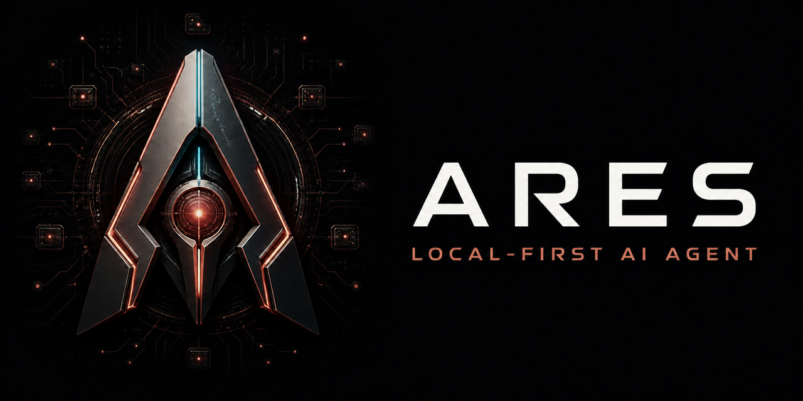
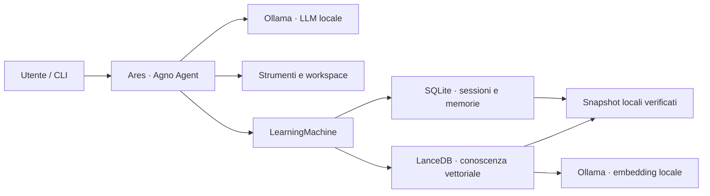

# Ares



[](https://www.python.org/)
[](https://ollama.com/)
[](https://www.agno.com/)
[](LICENSE)
[](https://github.com/KairosIta/Ares/actions/workflows/ci.yml)

Assistente AI personale local-first costruito con Python, Ollama e Agno.
Ares conversa, usa strumenti, mantiene memoria fra sessioni e lavora in uno
spazio controllato sul disco senza richiedere API cloud.

> **English summary:** Ares is a local-first personal AI agent built with
> Ollama and Agno. It combines persistent memory, tool use, a private
> workspace, verified local backups and explicit maintenance workflows in a
> reproducible Python project.

## Perché Ares

- **Inferenza locale:** modello conversazionale ed embedding serviti da
  Ollama su `localhost`.
- **Memoria persistente:** profilo, memorie, contesto di sessione, entità e
  conoscenza riutilizzabile attraverso SQLite e LanceDB.
- **Apprendimento affidabile:** l’estrazione avviene sul run completo, anche
  dopo una conferma e `continue_run`, con retry mirato sul contesto.
- **Strumenti controllati:** cronologia, ricerca, quaderno privato e workspace
  su disco con conferma per le operazioni sensibili.
- **Manutenzione esplicita:** audit e fusione delle entità duplicate con
  anteprima, lock, backup e rollback.
- **Backup locale verificato:** snapshot atomici dello stato persistente,
  restore protetto e retention configurabile.
- **Evidenza riproducibile:** prove isolate su archivi temporanei e test E2E
  reali contro Ollama.

## Architettura



Il modello principale risponde e usa gli strumenti. Dopo il turno, la
macchina di apprendimento aggiorna gli store configurati; entità e intuizioni
restano invece agentiche e vengono consultate o modificate solo quando Ares
decide di chiamarne gli strumenti.

## Requisiti

- Linux; la CI verifica il progetto su Ubuntu 24.04;
- Python 3.12;
- [`uv`](https://docs.astral.sh/uv/);
- [Ollama](https://ollama.com/) in ascolto su `localhost:11434`;
- spazio sufficiente per i modelli configurati.

La configurazione di riferimento è pensata per circa 16 GiB di VRAM. Il
modello Qwythos-9B Q8_0 può richiedere circa 14 GB con 262k token di contesto;
su hardware diverso è possibile scegliere un modello più piccolo e ridurre
`NUM_CTX` in [`config.py`](config.py).

Il modello predefinito è un artefatto esterno, non incluso nel repository:
consulta la [model card di Qwythos-9B](https://huggingface.co/empero-ai/Qwythos-9B-Claude-Mythos-5-1M-GGUF)
per licenza, provenienza e limiti. È un fine-tune dichiaratamente uncensored:
le risposte tecniche o sensibili richiedono verifica umana.

## Avvio rapido

Scarica i due modelli unici richiesti dalla configurazione predefinita:

```bash
ollama pull hf.co/empero-ai/Qwythos-9B-Claude-Mythos-5-1M-GGUF:Q8_0
ollama pull nomic-embed-text-v2-moe
```

Poi clona e prepara il progetto:

```bash
git clone https://github.com/KairosIta/Ares.git
cd Ares
./setup.sh
.venv/bin/python chat.py
```

Se Ollama non è gestito come servizio, avvialo prima con `ollama serve`.
`setup.sh` crea il virtualenv, sincronizza le versioni bloccate in
[`requirements.txt`](requirements.txt) ed esegue il preflight.

Per aprire una sessione separata:

```bash
.venv/bin/python chat.py --session progetto-demo
```

Durante la chat `/` apre il menu dei comandi e TAB completa la voce
selezionata. Invio spedisce il messaggio, `Alt+Invio` aggiunge una nuova riga,
le frecce percorrono la cronologia e i suggerimenti riprendono le domande
precedenti. Fra i comandi principali: `/profilo`, `/memorie`, `/contesto`,
`/sessioni`, `/entita`, `/file` e `/lavoro`.

## Verifica

La suite evita lo stato reale e costruisce archivi temporanei usa-e-getta.

```bash
# Cablaggio, store, strumenti e isolamento; nessuna inferenza
.venv/bin/python tests/smoke_test.py

# Backup/restore e manutenzione delle entità
.venv/bin/python tests/backup_test.py
.venv/bin/python tests/entity_maintenance_test.py

# Turno completo con modello locale e rilettura da un secondo processo
.venv/bin/python -u tests/e2e_test.py
```

La distinzione fra test offline ed E2E è descritta nella
[guida ai test](docs/testing.md).

## Operazioni

### Backup

```bash
.venv/bin/python backup.py create
.venv/bin/python backup.py list --verify
.venv/bin/python backup.py restore <snapshot>
.venv/bin/python backup.py prune
```

Gli snapshot vivono per default nella directory `ares-backup` accanto al
clone, non nel repository. Database, indice vettoriale, cronologia e workspace
restano esclusi da Git.

### Entità duplicate

```bash
.venv/bin/python entity_maintenance.py audit --all
.venv/bin/python entity_maintenance.py merge \
  --source project/doppione --into project/canonico
.venv/bin/python entity_maintenance.py merge \
  --source project/doppione --into project/canonico --apply
```

La prima fusione è solo un’anteprima. `--apply` richiede la chat chiusa,
acquisisce il lock esclusivo, crea un backup e domanda una conferma testuale.

## Località e sicurezza

Nell’uso ordinario inferenza e stato restano locali; non sono richieste
chiavi API cloud e la telemetria Agno è disabilitata. Installazione e download
dei modelli richiedono naturalmente accesso alla rete. Inoltre, i comandi
shell eseguiti nel workspace possono usare la rete quando l’utente li
autorizza: Ares è un agente locale controllato, non una sandbox di sicurezza.

Non committare `tmp/`, snapshot, `.env` o altri dati personali. Per segnalare
un problema di sicurezza consulta [`SECURITY.md`](SECURITY.md).

## Documentazione

- [Architettura](docs/architecture.md)
- [Strategia di test](docs/testing.md)
- [Roadmap](ROADMAP.md)
- [Istruzioni per contribuire](CONTRIBUTING.md)

## Stato del progetto

Ares è un progetto personale in sviluppo attivo. È pensato prima di tutto per
un singolo host Linux con Ollama locale; compatibilità multipiattaforma,
packaging come libreria e deployment distribuito non sono ancora obiettivi
garantiti.

## Licenza

Copyright © 2026 [KairosIta](https://github.com/KairosIta).
Distribuito sotto [Apache License 2.0](LICENSE).
