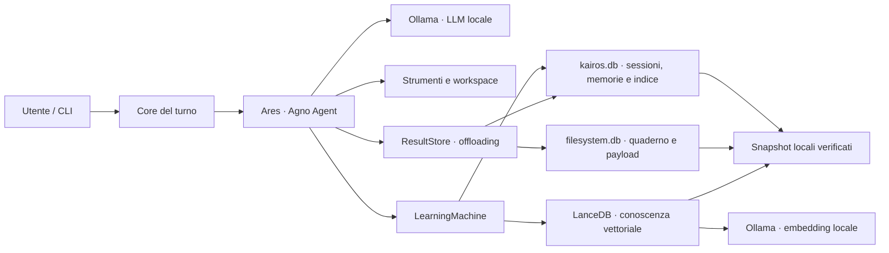

# Ares


[](https://www.python.org/)
[](https://ollama.com/)
[](https://www.agno.com/)
[](#requisiti)
[](LICENSE)
[](https://github.com/KairosIta/Ares/actions/workflows/ci.yml)

Assistente AI personale local-first costruito con Python, Ollama e Agno.
Ares conversa, usa strumenti, mantiene memoria fra sessioni e lavora in uno
spazio controllato sul disco senza richiedere API cloud.

> **English summary:** Ares is a local-first personal AI agent built with
> Ollama and Agno. It combines persistent memory, tool use, a private
> workspace, verified local backups and explicit maintenance workflows in a
> reproducible Python project.

## Perché Ares

- **Inferenza locale:** modello conversazionale ed embedding serviti da
  Ollama su `localhost`.
- **Memoria persistente:** profilo, memorie, contesto di sessione, entità e
  conoscenza riutilizzabile attraverso SQLite e LanceDB.
- **Apprendimento affidabile:** l’estrazione avviene sul run completo, anche
  dopo una conferma e `continue_run`, con retry mirato sul contesto.
- **Strumenti controllati:** cronologia, ricerca, quaderno privato e workspace
  su disco con conferma per le operazioni sensibili.
- **Contesto protetto:** entro la quota Agno i risultati molto grandi restano
  lossless negli archivi locali e vengono riletti a pagine, mentre le tool
  call storiche nel prompt hanno un limite esplicito.
- **Manutenzione esplicita:** audit e fusione delle entità duplicate e
  retention delle sessioni, con anteprima, lock, backup e rollback.
- **Backup locale verificato:** snapshot atomici dello stato persistente,
  restore protetto e retention configurabile.
- **Evidenza riproducibile:** prove isolate su archivi temporanei e test E2E
  reali contro Ollama.

## Architettura



Il modello principale risponde e usa gli strumenti. I risultati grandi
vengono indicizzati nel database principale e conservati in
`filesystem.db`, entrambi inclusi negli snapshot. Dopo il turno, la macchina
di apprendimento aggiorna gli store configurati; entità e intuizioni restano
invece agentiche e vengono consultate o modificate solo quando Ares decide di
chiamarne gli strumenti.

## Requisiti

- Linux o Windows; la CI verifica Ubuntu 24.04 e `windows-latest`;
- Python 3.12, installabile automaticamente da `uv`;
- [`uv`](https://docs.astral.sh/uv/);
- [Ollama](https://ollama.com/) in ascolto su `localhost:11434`;
- spazio sufficiente per i modelli configurati.

Su Windows, [Ollama richiede Windows 10 22H2 o
successivo](https://docs.ollama.com/windows). Il percorso verificato dal
progetto è Windows x86_64 con PowerShell; macOS e altre distribuzioni Linux
possono funzionare, ma non sono ancora nella matrice CI.

La configurazione di riferimento è pensata per circa 16 GiB di VRAM. Il
modello Qwythos-9B Q8_0 può richiedere circa 14 GB con 262k token di contesto;
su hardware diverso è possibile scegliere un modello più piccolo e ridurre
`NUM_CTX` in [`config.py`](config.py).

Il modello predefinito è un artefatto esterno, non incluso nel repository:
consulta la [model card di Qwythos-9B](https://huggingface.co/empero-ai/Qwythos-9B-Claude-Mythos-5-1M-GGUF)
per licenza, provenienza e limiti. È un fine-tune dichiaratamente uncensored:
le risposte tecniche o sensibili richiedono verifica umana.

## Avvio rapido

Installa [uv](https://docs.astral.sh/uv/getting-started/installation/) e
[Ollama](https://ollama.com/download), quindi scarica i due modelli unici
richiesti dalla configurazione predefinita:

```bash
ollama pull hf.co/empero-ai/Qwythos-9B-Claude-Mythos-5-1M-GGUF:Q8_0
ollama pull nomic-embed-text-v2-moe
```

Clona il progetto:

```bash
git clone https://github.com/KairosIta/Ares.git
cd Ares
```

Su Linux:

```bash
./setup.sh
.venv/bin/python chat.py
```

Su Windows, da PowerShell:

```powershell
.\setup.ps1
.\.venv\Scripts\python.exe chat.py
```

Se la policy di PowerShell impedisce l’avvio dello script locale, usa una
sola volta `powershell -ExecutionPolicy Bypass -File .\setup.ps1`.

Se Ollama non è già attivo, avvialo prima con `ollama serve`. Entrambi gli
script di setup creano il virtualenv, sincronizzano esattamente le versioni
di [`requirements.txt`](requirements.txt) ed eseguono il preflight. Su
Windows `setup.ps1 -SkipPreflight` prepara soltanto le dipendenze e viene
usato dalla CI, dove Ollama non è disponibile.

Per aprire una sessione separata:

```bash
.venv/bin/python chat.py --session progetto-demo
```

Su Windows il comando equivalente è:

```powershell
.\.venv\Scripts\python.exe chat.py --session progetto-demo
```

Durante la chat `/` apre il menu dei comandi e TAB completa la voce
selezionata. Invio spedisce il messaggio, `Alt+Invio` aggiunge una nuova riga,
le frecce percorrono la cronologia e i suggerimenti riprendono le domande
precedenti. Fra i comandi principali: `/profilo`, `/memorie`, `/contesto`,
`/sessioni`, `/entita`, `/file` e `/lavoro`.

## Verifica

La suite evita lo stato reale e costruisce archivi temporanei usa-e-getta.
I comandi seguenti mostrano il prefisso Linux; su Windows sostituisci
`.venv/bin/python` con `.\.venv\Scripts\python.exe`.

```bash
# Le prove offline: cablaggio, retention, backup/restore, entità e CLI
.venv/bin/python tests/run.py

# Anche quelle che accendono Ollama, incluso un turno completo
.venv/bin/python tests/run.py --tutte

# Offline, con la misura di copertura dei moduli
.venv/bin/python tests/run.py --copertura
```

Ogni prova resta anche uno script eseguibile da solo
(`.venv/bin/python tests/backup_test.py`); il runner le lancia una per
processo, perché ognuna prepara il proprio archivio temporaneo prima di
importare la configurazione.

La distinzione fra test offline ed E2E è descritta nella
[guida ai test](docs/testing.md).

## Operazioni

### Backup

```bash
.venv/bin/python backup.py create
.venv/bin/python backup.py list
.venv/bin/python backup.py verify latest
.venv/bin/python backup.py restore <snapshot>
.venv/bin/python backup.py prune --keep 20
```

Gli snapshot vivono per default nella directory `ares-backup` accanto al
clone, non nel repository. Database, indice vettoriale, cronologia e workspace
restano esclusi da Git.

Il backup resta un comando che dai tu. La chat però se ne accorge: se l'ultimo
snapshot ha più di `BACKUP_PROMEMORIA_GIORNI` giorni — sette per default, zero
spegne il promemoria — all'avvio te lo ricorda con la riga da eseguire, e tace
in tutti gli altri casi. Non prova a fare il backup da sola: un archivio con
LanceDB dentro richiede una decina di secondi e il lock esclusivo dello stato,
cioè esattamente ciò che non si fa mentre qualcuno sta aspettando un prompt.

### Entità duplicate

```bash
.venv/bin/python entity_maintenance.py audit --all
.venv/bin/python entity_maintenance.py merge \
  --source project/doppione --into project/canonico
.venv/bin/python entity_maintenance.py merge \
  --source project/doppione --into project/canonico --apply
```

La prima fusione è solo un’anteprima. `--apply` richiede la chat chiusa,
acquisisce il lock esclusivo, crea un backup e domanda una conferma testuale.

### Sessioni e risultati tool

```bash
.venv/bin/python session_maintenance.py status
.venv/bin/python session_maintenance.py prune --older-than 180
.venv/bin/python session_maintenance.py prune --older-than 180 --apply
.venv/bin/python session_maintenance.py delete <session-id> --apply
```

I risultati offloaded non hanno un TTL indipendente: vivono quanto la loro
conversazione, così una sessione conservata non contiene riferimenti scaduti.
Il prune seleziona invece intere sessioni per ultimo utilizzo, esclude quelle
protette in `SESSIONI_PROTETTE` e senza `--apply` mostra soltanto l'anteprima.
L'applicazione richiede la chat chiusa, il lock esclusivo, una conferma e uno
snapshot verificato; Agno rimuove a cascata run, indice e payload, mentre Ares
elimina anche il contesto appreso della sessione e verifica l'esito.

Agno limita ogni singolo payload a 8.000.000 byte e ogni sessione a
200.000.000 byte. Se una quota viene superata, il run continua con un
fallback dichiarato contenente testa e coda, ma il risultato completo non
viene conservato.

## Località e sicurezza

Nell’uso ordinario inferenza e stato restano locali; non sono richieste
chiavi API cloud e la telemetria Agno è disabilitata. Installazione e download
dei modelli richiedono naturalmente accesso alla rete. Inoltre, i comandi
shell eseguiti nel workspace possono usare la rete quando l’utente li
autorizza: Ares è un agente locale controllato, non una sandbox di sicurezza.

Non committare `tmp/`, snapshot, `.env` o altri dati personali. Per segnalare
un problema di sicurezza consulta [`SECURITY.md`](SECURITY.md).

## Documentazione

- [Architettura](docs/architecture.md)
- [Agno in Ares](docs/agno.md)
- [Strategia di test](docs/testing.md)
- [Roadmap](ROADMAP.md)
- [Istruzioni per contribuire](CONTRIBUTING.md)

## Stato del progetto

Ares è un progetto personale in sviluppo attivo, pensato per un singolo host
Linux o Windows con Ollama locale. La suite principale è verificata su
entrambi i sistemi; macOS, packaging come libreria e deployment distribuito
non sono ancora obiettivi garantiti.

## Licenza

Copyright © 2026 [KairosIta](https://github.com/KairosIta).
Distribuito sotto [Apache License 2.0](LICENSE).
