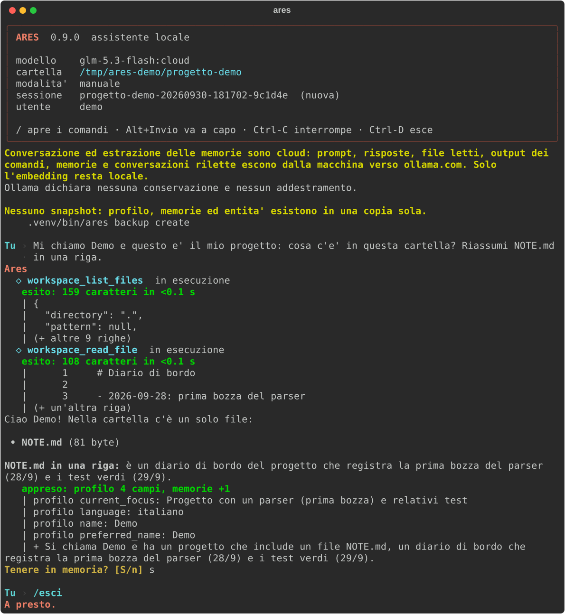
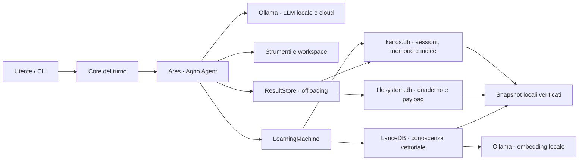

#  Ares


[](https://www.python.org/)
[](#locale-cloud-o-entrambi)
[](https://ollama.com/)
[](https://www.agno.com/)
[](#requisiti)
[](LICENSE)
[](https://github.com/KairosIta/Ares/actions/workflows/ci.yml)

Assistente AI personale costruito con Python, Ollama e Agno. Ares conversa,
usa strumenti, mantiene memoria fra sessioni e lavora in uno spazio
controllato sul disco. Di serie gira **interamente in scheda**; due righe nel
`.env` spostano conversazione ed estrazione sulle **versioni cloud dei
modelli Ollama**, senza chiavi API e senza cambiare una riga di codice.

> **English summary**
>
> - **Local-first by default.** Conversation, memory extraction and embeddings
>   all run on Ollama at `localhost`. Nothing leaves the machine and no API
>   keys are involved.
> - **Cloud when you choose.** Two lines in `.env` (`ARES_MAIN_MODEL`,
>   `ARES_LEARNING_MODEL`) move conversation and extraction — together or
>   separately — to an Ollama cloud model, relayed by the same local daemon.
>   Embeddings always stay local, by construction.
> - **An agent that remembers.** Persistent profile, memories, session
>   context, entities and reusable knowledge in SQLite and LanceDB, with a
>   system prompt that tells the model which models it runs on and what it may
>   do.
> - **Tools you control.** Four permission modes over a private workspace,
>   step-by-step confirmation of anything that leaves a trace on disk,
>   verified local snapshots and explicit maintenance workflows.



*Una conversazione vera, registrata dal terminale su uno stato nuovo con
`glm-5.3-flash:cloud`: Ares legge la cartella con gli strumenti sui file,
risponde, mostra cosa ha imparato su profilo e memorie e chiede se tenerlo.*

## Indice

- [Locale, cloud, o entrambi](#locale-cloud-o-entrambi)
- [Requisiti](#requisiti)
- [Avvio rapido](#avvio-rapido)
- [Perché Ares](#perché-ares)
- [Architettura](#architettura)
- [Come si usa](#come-si-usa)
- [Verifica](#verifica)
- [Operazioni](#operazioni)
- [Località e sicurezza](#località-e-sicurezza)
- [A chi non serve](#a-chi-non-serve)
- [Documentazione](#documentazione)
- [Stato del progetto](#stato-del-progetto)
- [Licenza](#licenza)

## Locale, cloud, o entrambi

Il valore distribuito è locale: appena clonato, Ares risponde con
`MODELLO_LOCALE`, che gira in scheda, e nessuna conversazione esce dalla
macchina. Il cloud è una scelta esplicita, in **due righe che vivono nel
`.env`** e non in `config.py`, che tornerebbe a divergere a ogni `git pull`.
Sono due perché rispondono a due domande diverse — a chi affidi la
conversazione, e a chi affidi ciò che Ares ricorda di te — e la seconda pesa
di più.

| Profilo | Nel `.env` | Cosa esce dalla macchina |
| --- | --- | --- |
| **Tutto in locale** *(distribuito)* | — | niente: conversazione, estrazione delle memorie ed embedding girano in scheda |
| **Conversazione in cloud** | `ARES_MAIN_MODEL=glm-5.3-flash:cloud` | domande e risposte, il prompt con profilo e memorie, i file che legge, l'output dei comandi, le conversazioni passate che rilegge |
| **Anche l'estrazione in cloud** | `ARES_LEARNING_MODEL=glm-5.3-flash:cloud` | quanto sopra, più il testo dei turni e le memorie già salvate, a ogni estrazione e a ogni `ares memories consolidate` |

Un [modello cloud di Ollama](https://ollama.com/search?c=cloud) si riconosce
dal tag `:cloud`. Il daemon locale lo inoltra a `ollama.com` dopo un
`ollama signin` una tantum: **Ares continua a parlare con `localhost`**, e
nessuna chiave API entra nell'ambiente o nel `.env`. Vale per tre ruoli su
quattro:

- **l'embedder resta locale sempre**, e non per configurazione ma per
  costruzione: [`agent/runtime.py`](ares/agent/runtime.py) si rifiuta di
  costruirlo su un nome cloud, perché cambiarlo invaliderebbe l'indice già
  scritto in LanceDB;
- il preflight e il banner della chat dicono **a ogni avvio** quali ruoli
  escono dalla macchina, e il prompt lo dice al modello, perché non prometta
  una privacy che non può mantenere;
- con la conversazione in cloud il modello locale serve solo l'estrazione, e
  gira con un contesto ridotto (`NUM_CTX_ESTRAZIONE`, 32k): **serve meno
  VRAM** — i numeri sono in [Requisiti](#quanta-memoria-serve);
- con lo stesso modello locale in entrambi i ruoli, cioè con il default, i
  due contesti restano uguali e Ollama non riavvia il runner fra la risposta
  e l'estrazione.

Quanto pesa l'estrazione è misurato: tre chiamate al modello per turno,
5.388 token di ingresso su un turno che aggiorna profilo e memorie, con i
numeri in [qualità della memoria](docs/memory-quality.md). Ollama dichiara di
elaborare quei contenuti in modo transitorio, di non conservarli oltre la
richiesta e di non usarli per addestrare
([privacy policy](https://ollama.com/privacy), marzo 2026). È un impegno
contrattuale, non una garanzia tecnica: per un uso interamente locale basta
che `ARES_MAIN_MODEL` e `ARES_LEARNING_MODEL` non nominino un modello cloud,
o non siano impostati.

## Requisiti

- Linux o Windows; la CI verifica Ubuntu 24.04 e `windows-latest`;
- Python 3.12 o 3.13; `setup.sh` e `setup.ps1` installano la 3.12 con `uv`,
  che è quella provata su entrambi i sistemi;
- [`uv`](https://docs.astral.sh/uv/);
- [Ollama](https://ollama.com/) in ascolto su `localhost:11434`;
- spazio sufficiente per i modelli configurati.

Su Windows, [Ollama richiede Windows 10 22H2 o
successivo](https://docs.ollama.com/windows). Il percorso verificato dal
progetto è Windows x86_64 con PowerShell; macOS e altre distribuzioni Linux
possono funzionare, ma non sono ancora nella matrice CI.

### Quanta memoria serve

La configurazione di riferimento è pensata per circa **16 GiB di VRAM**. Il
modello locale Qwen3.8-9B Q8_0 occupa circa **12,4 GB con 128k token di
contesto**, il default, quando è lui a conversare, e circa **9 GB quando fa
solo l'estrazione delle memorie accanto a un modello cloud**: in quel caso il
contesto dell'estrazione scende a `NUM_CTX_ESTRAZIONE` (32k), perché
un'estrazione riceve solo il testo del turno.

Il contesto si cambia con `ARES_NUM_CTX` nel `.env`. Conta che il modello
stia tutto in scheda: a 256k lo stesso modello occupa 19,5 GB, un quarto
gira sulla CPU, e risposta ed estrazione diventano due volte e mezzo più
lente (le misure sono in [qualità della
memoria](docs/memory-quality.md#latenza-dellestrazione-30-settembre-2026)).
`ares preflight`, dopo un turno di chat, dice se il modello non sta in VRAM e
di quanto. Con meno VRAM si abbassa `ARES_NUM_CTX` o si sceglie un modello
più piccolo.

Anche il campionamento si regola dal `.env` (`ARES_TEMPERATURE`,
`ARES_TOP_P`, `ARES_TOP_K`, `ARES_MIN_P`, `ARES_REPEAT_PENALTY`,
`ARES_PRESENCE_PENALTY`): omessi valgono i default di Ollama, che Ares manda
espliciti. Le schede dei modelli ne consigliano spesso altri, e con un
modello diverso da quello di serie conviene provarli con gli eval prima di
adottarli; i valori sono commentati in [`.env.example`](.env.example).

Con un modello di estrazione locale, il contesto di sessione non passa da
una tool call: Ares chiede un oggetto JSON vincolato dallo schema (il
`format` di Ollama), così un modello piccolo non dimentica la chiamata e non
ne sbaglia la forma. Profilo e memorie restano sulla tool call, dove i
modelli piccoli scrivono di più. Con un modello cloud resta la tool call, perché il
cloud di Ollama non applica lo schema. `ARES_ESTRAZIONE_VINCOLATA=0` lo
spegne.

I modelli sono artefatti esterni, non inclusi nel repository: consulta la
[model card di Qwen3.8-9B-Distill](https://huggingface.co/empero-ai/Qwen3.8-9B-Distill-GGUF)
e la [scheda di glm-5.3-flash](https://ollama.com/library/glm-5.3-flash) per
licenza, provenienza e limiti. Le risposte tecniche o sensibili richiedono
verifica umana.

## Avvio rapido

Installa [uv](https://docs.astral.sh/uv/getting-started/installation/) e
[Ollama](https://ollama.com/download), quindi scarica i due modelli della
configurazione predefinita:

```bash
ollama pull hf.co/empero-ai/Qwen3.8-9B-Distill-GGUF:Q8_0
ollama pull nomic-embed-text-v2-moe
```

### Modello locale

Il GGUF di serie arriva da Hugging Face senza `RENDERER` né `PARSER` nel
Modelfile. Ollama usa allora il template incorporato, che non riceve il
ragionamento dei passi precedenti: con il ragionamento acceso, il default,
dopo uno strumento il modello può rispondere dentro il ragionamento e
lasciare vuota la risposta. Si rimedia con una copia che dichiara renderer
e parser di Qwen3.8, come il modello della libreria di Ollama. I pesi sono
gli stessi e non occupano altro spazio. Crea un file `Modelfile` con:

```text
FROM hf.co/empero-ai/Qwen3.8-9B-Distill-GGUF:Q8_0
RENDERER qwen3.8
PARSER qwen3.5
```

poi crea la copia e indicala nel `.env`:

```bash
ollama create ares-qwen3.8-9b -f Modelfile
```

```dotenv
ARES_MAIN_MODEL=ares-qwen3.8-9b
ARES_LEARNING_MODEL=ares-qwen3.8-9b
```

`ares preflight` segnala un modello locale col ragionamento acceso che non
dichiara un renderer. Lo stesso vale per altri GGUF importati: renderer e
parser giusti sono quelli del modello corrispondente nella libreria di
Ollama.

### Un secondo modello locale: il 27B

Sulla stessa scheda da 16 GiB sta anche
[Qwen3.8-27B-GSQ-RCO-GGUF](https://huggingface.co/ISTA-DASLab/Qwen3.8-27B-GSQ-RCO-GGUF)
di ISTA-DASLab nella variante IQ3_S (3,5 bit per peso, 12,7 GB), a due
condizioni: il contesto scende a **64k** e il daemon Ollama tiene la KV
cache a 8 bit. Sugli eval di Ares il 27B pareggia il modello cloud (33
controlli su 33 sugli strumenti, la memoria senza contenuti inventati nel
profilo) dove il 9B di serie fa 27 su 33 e inventa; in cambio un turno di
sola conversazione costa 25-40 secondi, uno in cui lavora con gli strumenti
quattro o cinque minuti, e l'attesa dopo ogni risposta è di tre quarti di
minuto. Le misure sono in [qualità della memoria](docs/memory-quality.md) e
[strumenti in conversazione](docs/conversation-eval.md).

Le due variabili del servizio Ollama, da mettere nel suo drop-in di
systemd (`/etc/systemd/system/ollama.service.d/override.conf`) o
nell'ambiente del daemon, e poi riavviarlo:

```ini
Environment="OLLAMA_FLASH_ATTENTION=1"
Environment="OLLAMA_KV_CACHE_TYPE=q8_0"
```

Senza, il 27B a 64k esce di 2 GiB dalla scheda e un ottavo gira sulla CPU;
con, occupa 13,5 GiB. La stessa cache dimezza anche quella del 9B di serie
a 128k (da 12,4 a 10,7 GiB). Poi la copia con renderer e il `.env`:

```text
FROM hf.co/ISTA-DASLab/Qwen3.8-27B-GSQ-RCO-GGUF:IQ3_S
RENDERER qwen3.8
PARSER qwen3.5
```

```bash
ollama pull hf.co/ISTA-DASLab/Qwen3.8-27B-GSQ-RCO-GGUF:IQ3_S
ollama create ares-qwen3.8-27b -f Modelfile
```

```dotenv
ARES_MAIN_MODEL=ares-qwen3.8-27b
ARES_LEARNING_MODEL=ares-qwen3.8-27b
ARES_NUM_CTX=65536
```

A 64k la finestra si riempie in una quindicina di turni di lavoro:
`ares --metriche` mostra quanto ne è occupata, e `ares preflight` dopo un
turno conferma che il modello sta in scheda.

Solo se scegli la conversazione in cloud servono anche l'accesso e il
manifesto del modello remoto — il pull scarica il solo manifesto, l'accesso
serve alla prima richiesta:

```bash
ollama signin
ollama pull glm-5.3-flash:cloud
```

Clona il progetto:

```bash
git clone https://github.com/KairosIta/Ares.git
cd Ares
```

Su Linux:

```bash
./setup.sh
ares
```

Su Windows, da PowerShell:

```powershell
.\setup.ps1
ares
```

Se la policy di PowerShell impedisce l’avvio dello script locale, usa una
sola volta `powershell -ExecutionPolicy Bypass -File .\setup.ps1`.

Se Ollama non è già attivo, avvialo prima con `ollama serve`. Gli script di
setup creano il virtualenv, installano esattamente le versioni di
[`uv.lock`](uv.lock) e Ares stesso, mettono `ares` sul PATH ed eseguono il
preflight. Il comando è un link in `~/.local/bin` su Linux e uno shim
`ares.cmd` in `%USERPROFILE%\.local\bin` su Windows; `ARES_BIN_DIR`
sceglie un’altra directory, e se non è nel PATH il setup dice la riga da
aggiungere. Non è un `uv tool install`, che ignorerebbe il lock: il comando
globale usa l’ambiente bloccato e segue il codice del clone a ogni pull.

`ares` da solo apre la chat, `ares --help` elenca i sottocomandi di
manutenzione (`ares backup`, `ares sessions`, `ares entities`, `ares
memories`, `ares skills`, `ares preflight`, `ares inspect`, `ares migrate`).
Ognuno ha il suo alias (`ares-backup`, `ares-skills`...) che fa la stessa
cosa, e dal clone funziona anche `python -m ares`. Su Windows `setup.ps1 -SkipPreflight` prepara soltanto le
dipendenze: lo usa la CI, dove Ollama non c'è.

Tutto ciò che Ares impara vive in `~/.ares` (lo stato in `stato/`, gli
snapshot in `backup/`, le skill e le proposte in `skills/`), fuori dal clone, che si può spostare o rifare senza
perdere niente. `ARES_HOME` nel `.env` sposta tutto altrove. Un clone che
teneva lo stato in `tmp/` viene migrato dal setup con `ares migrate`; finché
non succede né la chat né backup e manutenzione partono, per non sdoppiare
l'archivio.

## Perché Ares

- **Memoria che dura fra le sessioni.** Profilo, memorie, contesto di
  sessione, entità e conoscenza riutilizzabile, in SQLite e LanceDB, senza
  servizi da avviare.
- **Apprendimento sul turno completo, non su una fotografia a metà.**
  L'estrazione avviene quando il run è davvero concluso, anche dopo una
  conferma e un `continue_run`, con retry mirato sul contesto e criteri che
  distinguono fatti, ipotesi e proposte non accettate.
- **Strumenti controllati, in quattro modalità.** Cronologia, ricerca,
  quaderno privato e la cartella da cui lanci `ares` come spazio di lavoro.
  Quanto Ares fa da solo lo decide la modalità, e ogni cosa che lascia una
  traccia sul disco chiede conferma mostrando per intero cosa sta per fare.
  C'è un avviso prima di aprire una cartella rischiosa. La
  [tabella delle modalità](#la-cartella-e-le-modalità) è più sotto.
- **Memoria visibile e revocabile.** Sotto ogni risposta compare cosa è
  entrato in profilo e memorie, sia dagli strumenti del modello sia
  dall'estrazione automatica, con il testo intero, e la CLI chiede se
  tenerlo: un `n` riporta i due store a prima del turno. Tace quando non è
  cambiato niente. Un valore estratto che non ha appiglio nella
  conversazione, come una professione o una tecnologia mai nominate o un
  «Non specificato» in un campo vuoto, non entra: l'eco lo elenca come non
  appreso. Una memoria corretta o tolta non sparisce: `/memorie superate`
  la mostra con la data, e `/memorie origine` dice da quale conversazione e
  cartella viene ciascuna memoria. Lo sa anche Ares: a «da dove lo sai?»
  risponde con la conversazione in cui gliel'hai detto.
- **Il contesto non si satura, e lo stato si può riprendere.** Entro la quota
  Agno i risultati molto grandi restano lossless negli archivi locali e
  vengono riletti a pagine; snapshot verificati, restore protetto, fusione
  delle entità duplicate e retention delle sessioni sono comandi espliciti,
  con anteprima, lock e rollback.
- **Consapevole di sé, e messo alla prova.** Il prompt si apre con una scheda
  letta dalla configurazione di quell'avvio — quale modello parla e se è
  locale o cloud, quale estrae le memorie, quanto contesto ha in vista,
  sistema e shell, cartella, ramo e modalità — tutto in italiano, guide di
  Agno comprese. `ares inspect --prompt` lo stampa per intero. Le prove sono
  isolate su archivi temporanei, con test E2E reali contro Ollama e una
  copertura misurata: [la strategia](docs/testing.md).

## Architettura


```mermaid
flowchart LR
    U["Utente / CLI"] --> C["Core del turno"]
    C --> A["Ares · Agno Agent"]
    A --> O["Ollama · LLM locale o cloud"]
    A --> T["Strumenti e workspace"]
    A --> R["ResultStore · offloading"]
    A --> L["LearningMachine"]
    L --> S["kairos.db · sessioni, memorie e indice"]
    L --> V["LanceDB · conoscenza vettoriale"]
    R --> S
    R --> F["filesystem.db · quaderno e payload"]
    V --> E["Ollama · embedding locale"]
    S --> B["Snapshot locali verificati"]
    F --> B
    V --> B
```

Il modello principale risponde e usa gli strumenti. I risultati grandi
vengono indicizzati nel database principale e conservati in
`filesystem.db`, entrambi inclusi negli snapshot. Dopo il turno, la macchina
di apprendimento aggiorna gli store configurati; entità e intuizioni restano
invece agentiche e vengono consultate o modificate solo quando Ares decide di
chiamarne gli strumenti. Quegli strumenti non arrivano al modello finché non
li attiva con `attiva_strumenti`: il prompt li descrive con una riga, e
ogni richiesta pesa circa un quinto in meno (`ARES_STRUMENTI_SU_RICHIESTA=0`
li dà tutti da subito).

## Come si usa

### La cartella e le modalità

Ares lavora nella cartella da cui lo lanci, come Claude Code o Codex: entra
nel progetto e scrivi `ares`. Il banner mostra la cartella e, se è un
repository, il ramo. Gli strumenti sui file non escono da lì, e quanto Ares
fa da solo lo decide la modalità:

| Modalità    | Da solo                     | Con conferma                                         |
| ----------- | --------------------------- | ---------------------------------------------------- |
| `manuale`   | leggere, elencare, cercare  | scrivere, modificare, spostare, cancellare, eseguire |
| `modifiche` | anche scrivere e modificare | spostare, cancellare, eseguire                       |
| `piano`     | leggere, elencare, cercare  | niente: gli altri strumenti non ci sono              |
| `auto`      | tutto                       | niente                                               |

`manuale` è il valore distribuito: ciò che Ares legge — un file, l'output di
un comando, lo stesso `ARES.md` — può contenere un'istruzione, e una
scrittura che nessuno guarda può riscrivere uno script o un Makefile. La
conferma mostra per intero cosa sta per succedere e, per un file che esiste
già, la differenza riga per riga. `ares --modo modifiche` sceglie per una
sessione, `/modo piano` cambia a metà conversazione, e il modello sa in
quale modalità si trova. `auto` si sceglie solo con `ares --modo auto`, e il
banner lo dice in rosso.

I comandi non restano nella cartella. Partono da lì, ma possono leggere e
scrivere ovunque tu possa, compreso lo stato di Ares, e usare la rete: la
cartella delimita gli strumenti sui file, non la shell. Per questo in
`manuale` e `modifiche` ogni comando chiede conferma, mentre in `auto` un
comando suggerito da un file letto gira subito. `auto` va bene su un
progetto di cui ti fidi, o dentro un container; il dettaglio è in
[`SECURITY.md`](SECURITY.md#senza-sandbox-di-serie).

Su Linux puoi chiudere i comandi in una sandbox con `ARES_SANDBOX=bwrap`
nel `.env` (serve il pacchetto `bubblewrap`). Un comando scrive allora solo
nella cartella e in una `/tmp` privata, non vede lo stato di Ares né le
credenziali note della home, non ha la rete (`ARES_SANDBOX_RETE=1` la
ridà) e i processi che lascia in background muoiono con lui. Se la sandbox
non si può applicare la chat non parte, invece di girare senza; banner,
`/cartella` e `ares preflight` dicono se è accesa. Dentro la cartella un
comando resta libero: i limiti sono in
[`SECURITY.md`](SECURITY.md#la-sandbox-opzionale-su-linux).

Con `-p`, e in generale quando stdin non è un terminale, valgono solo
`manuale` e `piano`, e gli store di apprendimento non vengono aggiornati:
nessuno guarda, e una conferma letta dalla stessa pipe che porta
l'istruzione non è una conferma.

Se la cartella è rischiosa — la home intera, la radice del disco, una
directory di sistema, una che contiene lo stato o il codice di Ares, una che
sta dentro `~/.ares`, dove gli strumenti scriverebbero stato, backup o skill
attive — te lo dice e chiede di riscrivere il percorso prima di partire; da uno script senza
terminale una cartella così si apre solo nominandola con `--workspace`. Per
lavorare su un'altra cartella senza spostarti:

```bash
ares --workspace ~/progetti/demo
```

### Le regole del progetto

Se nella cartella c'è un `ARES.md`, Ares lo legge prima del primo turno: è
il posto per le convenzioni del progetto, cosa non toccare, come si lanciano
le prove. Lo riceve come regole del progetto, delimitate, non come ordini
tuoi: le applica finché non contraddicono ciò che gli chiedi, e nulla che
scriva o lanci comandi parte per conto del file. `ares init` ne scrive uno
scheletro nella cartella corrente e non tocca un file che esiste già.

### Le regole di autorizzazione

In `manuale` ogni comando chiede conferma, `git status` quanto `rm -rf`. Per
non passare ad `auto` solo per la fatica, puoi dichiarare in un file TOML
quali comandi girano senza chiedere e quali non girano mai:

```toml
# .ares/permessi.toml nella cartella, o ~/.ares/permessi.toml per te
[comandi]
consenti = ["git status", "git log", "git diff", "ls", "uv run pytest"]
nega = ["rm -rf", "git push", "curl", "wget"]
```

Una regola è un prefisso sulle parole del comando: `git status --short` è
coperto da `git status`, `git statusx` no. Un comando composto passato a
una shell (`bash -lc "git add . && git push"`) viene spezzato e ogni parte
deve essere coperta; `nega` vince su `consenti`; una parte scoperta, una
redirezione, una sostituzione (`$(...)`) o una riga di PowerShell fanno
chiedere come oggi. I due file si sommano. Una regola non concede ciò che
la modalità vieta: tace una conferma che la modalità chiederebbe, e solo
con qualcuno davanti, mai da una pipe. `nega` vale anche in `auto`. Il
banner dice quante regole ha letto e da dove, `/cartella` pure, e ogni
comando deciso da una regola compare nel terminale con la regola che l'ha
deciso. Il prefisso è una convenzione, non una sandbox: uno script nella
cartella che si chiama `git` resta un rischio, come dice
[`SECURITY.md`](SECURITY.md#senza-sandbox-di-serie).

### Le skill

Una skill è una procedura scritta per un compito che ritorna: come scrivi le
note di riunione, come si rilascia il progetto, come si prepara un report.
È una cartella con un `SKILL.md`, nel formato aperto *Agent Skills* che
leggono anche Claude Code e Codex:

```markdown
---
name: note-riunione
description: Scrive le note di una riunione nel formato della persona. Usala quando c'è una riunione da annotare.
---

1. Crea riunioni/AAAA-MM-GG-tema.md, con il tema in minuscolo e i trattini.
2. ...
```

Ares le cerca in `~/.ares/skills/` (le tue) e in `.ares/skills/` della
cartella (quelle del progetto, da versionare con il resto). Nel prompt entra
solo la riga `name: description`; la procedura il modello la legge con
`leggi_skill` quando la richiesta corrisponde. Ares le legge e basta: gli
script di una skill non partono da soli, e un comando che la procedura
suggerisce passa dalle stesse conferme di ogni altro. Quelle del progetto
valgono come `ARES.md`, regole della cartella e non ordini tuoi; a parità di
nome vince la tua.

Ares può anche **proporne** una, quando gli chiedi di salvare un
procedimento o dopo una procedura in più passi che servirà di nuovo. La
proposta va in `~/.ares/skills/proposte/`, che non si carica: diventa attiva
solo quando la adotti.

```bash
ares skills list                       # attive, non caricate e proposte
ares skills adopt note-riunione        # la mostra
ares skills adopt note-riunione --apply
ares skills discard note-riunione --apply
```

Adottarne una con il nome di una attiva conserva la versione di prima in
`~/.ares/skills/.precedenti/`. Il banner e `/skill` dicono quali skill vede
la conversazione e quante proposte aspettano; `ARES_SKILL=0` le spegne.

### Le conversazioni

Ogni `ares` apre una conversazione nuova, che nasce nella cartella e la
ricorda: profilo e memorie ci sono comunque, perché sono tuoi e non della
conversazione, mentre obiettivo, piano e avanzamento partono vuoti. Per
tornare dove eri:

```bash
ares resume            # l'ultima conversazione nata in questa cartella
ares resume --scegli   # la scegli da un elenco numerato
```

Le conversazioni di altre cartelle non c'entrano: `/sessioni` mostra quelle
di qui, `/sessioni tutte` le altre, e anche Ares riceve all'avvio le ultime di
questa cartella, con l'id, così "dove eravamo rimasti" funziona anche in una
conversazione nuova. Un nome fisso resta possibile con `--session`:

```bash
ares --session progetto-demo
```

### Una risposta sola

Per una risposta sola, anche dentro una pipe, `-p`: stdin si aggiunge alla
domanda, le operazioni che chiederebbero conferma vengono rifiutate e gli
store di apprendimento non vengono aggiornati. Le memorie già presenti
restano nel contesto; la conversazione viene archiviata e il quaderno resta
scrivibile, ma solo su richiesta esplicita. Su stdout esce la sola
risposta; strumenti, avvisi e metriche vanno su stderr.

```bash
git diff | ares -p "scrivi il messaggio di commit"
```

`ares resume -p "..."` fa lo stesso sull'ultima conversazione nata in questa
cartella, con il suo contesto.

Esce con `0` solo se il turno si è concluso: `2` se si è fermato su una
conferma che nessuno poteva dare, `1` se è stato annullato o è fallito.

### La chat

Durante la chat `/` apre il menu dei comandi e TAB completa la voce
selezionata, e dopo lo spazio anche l'argomento: `/modo ` propone le
modalità, `/sessione ` le conversazioni di questa cartella. Invio spedisce il
messaggio, `Alt+Invio` aggiunge una nuova riga, `Ctrl-C` svuota la riga
lasciandola in cronologia, `Ctrl-D` chiude come `/esci`; le frecce
percorrono la cronologia e i suggerimenti riprendono le domande precedenti.
La barra sotto il prompt dice modalità, sessione e, dopo il primo turno,
quanta finestra di contesto è occupata.

Fra i comandi principali: `/profilo`, `/memorie`, `/contesto`, `/sessioni`,
`/entita`, `/file`, `/skill` e `/cartella`, che mostra percorso, ramo, file
modificati e se c'è un `ARES.md`. Quattro cambiano la sessione in corso senza
riavviare: `/sessione <id>` passa a un'altra conversazione e `/sessione
nuova` ne apre una, `/modo` cambia modalità, `/metriche` accende il costo di
ogni turno, `/debug` le chiamate al modello. `/esporta` scrive la
conversazione in un file Markdown nella cartella di lavoro, `Tu` e `Ares` a
turni; `/esporta <file>` sceglie il nome.

### Cosa Ares sa di sé

Il system message non è un testo fisso: si apre con la scheda dell'avvio
(vedi [Perché Ares](#perché-ares)), poi spiega al modello come funziona la
sua memoria — quali archivi si aggiornano da soli e quali con gli
strumenti — e cosa può fare senza chiedere. Le guide che Agno aggiunge per
i propri strumenti sono riscritte in italiano, per una persona sola. Per
leggerlo tutto, esattamente come lo riceve il modello:

```bash
ares inspect --prompt                # la conversazione che aprirebbe adesso, qui
ares inspect --prompt --modo piano   # nella modalità piano
```

Composizione, criteri dell'estrattore, limiti e casi di verifica sono in
[docs/prompt.md](docs/prompt.md).

## Verifica

La suite evita lo stato reale e costruisce archivi temporanei usa-e-getta.
I comandi seguenti mostrano il prefisso Linux; su Windows sostituisci
`.venv/bin/python` con `.\.venv\Scripts\python.exe`.

```bash
# Le prove offline: cablaggio, retention, costo dell'apprendimento, radicamento,
# backup/restore, entità, consolidamento delle memorie, sandbox, skill, CLI,
# valutazione e coerenza della versione dichiarata
.venv/bin/python tests/run.py

# Anche quelle che accendono Ollama, incluso un turno completo
.venv/bin/python tests/run.py --tutte

# Offline, con la misura di copertura dei moduli
.venv/bin/python tests/run.py --copertura
```

Ogni prova è anche uno script eseguibile da solo
(`.venv/bin/python tests/backup_test.py`). Il runner, la distinzione fra
prove offline ed E2E e la copertura sono descritti nella
[guida ai test](docs/testing.md).

Per misurare cosa viene ricordato e recuperato su dialoghi sintetici:
`.venv/bin/python -m evals.memory_quality --ripetizioni 3`. Il
[benchmark della memoria](docs/memory-quality.md) copre ipotesi, finzione,
accettazione, correzioni, preferenze temporanee, recupero in una nuova
sessione, abbandono di idee o piani e distinzione fra decisione e avvio del
lavoro, con rapporti JSON e Markdown e stato isolato. Per l'uso degli
strumenti con il prompt vero - quaderno o cartella, conferme, comandi,
risultati lunghi, entità e intuizioni attivate su richiesta, istruzioni
nascoste in un file - c'è
`.venv/bin/python -m evals.conversazione` ([strumenti in
conversazione](docs/conversation-eval.md)).

## Operazioni

Più chat possono restare aperte. I turni dello stesso utente vengono però
serializzati fino alla conferma degli apprendimenti: se un'altra chat sta
lavorando, Ares lo segnala e puoi riprovare quando ha finito. Con `ares -p`
la contesa termina con codice 3. Utenti diversi possono lavorare insieme.

I comandi di manutenzione mostrano tabelle sul terminale e testo piatto in
una pipe; gli errori vanno su stderr. Prima di toccare lo stato chiedono di
riscrivere una frase esatta, con lo stesso editor della chat; da uno
script la frase si passa su stdin, e `ares backup restore`/`prune` e
`ares sessions prune`/`delete` accettano anche `--yes`, che la salta. Quelli che leggono
soltanto accettano `--json`: `ares backup list`, `ares backup verify`,
`ares sessions status`, `ares entities audit`, `ares preflight`.

I codici di uscita sono gli stessi per ogni comando, chat compresa:

| Codice | Significato |
| --- | --- |
| `0` | fatto |
| `1` | guasto |
| `2` | rifiutato: argomenti incoerenti, conferma negata, cartella rifiutata, niente da riprendere |
| `3` | stato occupato da un altro processo, da riprovare |

### Backup

```bash
ares backup create
ares backup list
ares backup verify latest
ares backup restore <snapshot>
ares backup prune --keep 20
```

Gli snapshot vivono per default in `~/.ares/backup`, accanto allo stato e
fuori dal clone; `ARES_BACKUP_DIR` nel `.env` li sposta altrove. Database,
indice vettoriale e cronologia restano esclusi da Git. Le skill in
`~/.ares/skills` sono file tuoi fuori dallo stato: gli snapshot non le
includono.

Il backup è un comando che dai tu. Se l'ultimo snapshot ha più di
`BACKUP_PROMEMORIA_GIORNI` giorni (sette per default, zero spegne il
promemoria) la chat all'avvio te lo ricorda con la riga da eseguire. Non lo
fa da sola: richiede una decina di secondi e il lock esclusivo dello stato,
proprio mentre qualcuno aspetta il prompt.

### Entità duplicate

```bash
ares entities audit --all
ares entities merge \
  --source project/doppione --into project/canonico
ares entities merge \
  --source project/doppione --into project/canonico --apply
```

La prima fusione è solo un’anteprima. `--apply` richiede la chat chiusa,
acquisisce il lock esclusivo, crea un backup e domanda una conferma testuale.

### Memorie doppie o superate

```bash
ares memories consolidate
ares memories consolidate --apply
```

L'estrazione salva una memoria alla volta: con il tempo la stessa cosa
compare scritta in due modi, e una preferenza cambiata convive con quella
vecchia. Il consolidamento chiede all'embedder locale le coppie vicine e al
modello di apprendimento se ciascuna è un doppione, una memoria superata o
due cose distinte; di una memoria superata ritira la più vecchia, di un
doppione tiene la più completa. Senza `--apply` mostra soltanto il piano. Con
`--apply` vale lo stesso protocollo della fusione delle entità: chat
chiusa, conferma scritta, backup verificato. Le ritirate non si cancellano:
passano fra le superate, con il rimando a quella che resta, e
`/memorie superate` le mostra.

### Sessioni e risultati tool

```bash
ares sessions status
ares sessions prune --older-than 180
ares sessions prune --older-than 180 --apply
ares sessions delete <session-id> --apply
```

I risultati offloaded non hanno un TTL indipendente: vivono quanto la loro
conversazione, così una sessione conservata non contiene riferimenti scaduti.
Il prune seleziona invece intere sessioni per ultimo utilizzo, esclude quelle
protette in `SESSIONI_PROTETTE` e senza `--apply` mostra soltanto l'anteprima.
L'applicazione richiede la chat chiusa, il lock esclusivo, una conferma e uno
snapshot verificato; Agno rimuove a cascata run, indice e payload, mentre Ares
elimina anche il contesto appreso della sessione e verifica l'esito.

Agno limita ogni singolo payload a 8.000.000 byte e ogni sessione a
200.000.000 byte. Se una quota viene superata, il run continua con un
fallback dichiarato contenente testa e coda, ma il risultato completo non
viene conservato.

## Località e sicurezza

Stato ed embedding restano locali e la telemetria Agno è disabilitata; non
servono chiavi API. Il cloud è solo quello scelto nel `.env` (vedi
[Locale, cloud, o entrambi](#locale-cloud-o-entrambi)), e lo smoke test
verifica che l'embedder rifiuti un modello cloud.

Ciò che il modello legge può contenere un'istruzione: per questo ogni
strumento che lascia una traccia sul disco chiede conferma nella modalità
distribuita, `ARES.md` entra nel prompt come regole delimitate e non come
ordini, ogni file, output o archivio che gli strumenti riportano arriva al
modello delimitato come dati con la fonte dichiarata, e `ares -p` non scrive
in memoria. Installazione e download dei
modelli richiedono la rete, e i comandi shell autorizzati possono usarla:
Ares è un agente locale controllato, non una sandbox di sicurezza, anche
con la sandbox opzionale dei comandi, che protegge la macchina e non il
progetto. Il
modello di sicurezza completo è in [`SECURITY.md`](SECURITY.md), che dice
anche come segnalare un problema.

Non committare lo stato appreso, snapshot, `.env` o altri dati personali.

## A chi non serve

Meglio dirlo prima, per non deludere nessuno:

- **non è multi-utente né distribuito.** È pensato per un host e una persona:
  gli archivi sono locali, i turni dello stesso utente si serializzano, e non
  c'è un server da esporre;
- **non è una sandbox.** Gli strumenti sui file restano nella cartella
  scelta, ma i comandi — quelli che autorizzi, o tutti in `auto` — possono
  usare la rete e leggere e scrivere ciò che il tuo utente può. La sandbox
  opzionale su Linux ne restringe il raggio, ma non è il modo di dare un
  modello a dati che non vuoi far leggere;
- **non è una libreria né un prodotto.** Non c'è packaging per l'import, non
  c'è una UI oltre al terminale, e le API interne cambiano senza preavviso;
- **non è il più adatto se** cerchi un agente integrato nell'editor, un
  servizio gestito con modelli altrui, o qualcosa che funzioni senza
  installare Ollama.

## Documentazione

- [Architettura](docs/architecture.md)
- [Agno in Ares](docs/agno.md)
- [Il prompt e l'apprendimento](docs/prompt.md)
- [Qualità della memoria](docs/memory-quality.md)
- [Strumenti in conversazione](docs/conversation-eval.md)
- [Strategia di test](docs/testing.md)
- [Ambiti di progetto](docs/project-scopes.md)
- [Contratto del core](docs/core-contract.md)
- [Migliorie agentiche con il modello locale al centro](docs/agentic-improvements.md)
- [Roadmap](docs/ROADMAP.md)
- [Istruzioni per contribuire](CONTRIBUTING.md)

## Stato del progetto

Ares è un progetto personale in sviluppo attivo, pensato per un singolo host
Linux o Windows con Ollama locale. La suite principale è verificata su
entrambi i sistemi; macOS, packaging come libreria e deployment distribuito
non sono ancora obiettivi garantiti. La versione della release corrente e le
sue verifiche sono in [CHANGELOG.md](CHANGELOG.md).

## Licenza

Copyright © 2026 [KairosIta](https://github.com/KairosIta).
Distribuito sotto [Apache License 2.0](LICENSE).
